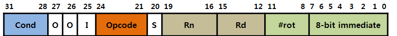

# ARM 

ARM은 임베디드에 많이 사용되는 RISC 프로세서이다.

임베디드 해킹을 할때 쓰인다.

## 레지스터

레지스터는 'r'에 숫자를 붙여 표기한다.

- r0~r12 까지 15개의 범용 레지스터가 존재한다. 이름 및 용도는 아래와 같다.


| Register | 용도 | 설명 |
| -------- | ----- | ---- |
| r0~r3 | 인자값 저장 | 함수 호출할때 인자값을 저장하는 용도로 사용 |
| r4~r10 | 범용 레지스터 | 마음대로 쓰이는 범용 레지스터이다. |
| r11   | SFP | 스택 프레임 포인터 (= ebp) |
| r12 | 범용 레지스터 | 마음대로 쓰이는 범용 레지스터이다. |
| r13 | SP(Stack Pointer) | 스택의 최상단을 가리킴(= esp) |
| r14 | LR(Link Register) | 서브루틴 후 돌아갈 리턴 주소 저장 |
| r15 | PC(Program Counter) | 현재 fetch 되고 있는 명령어의 주소 (현재 실행되는 명령어의 다음 다음 주소) (= eip) |
| CPSR | 상태 레지스터 | 현재 프로그램의 상태 레지스터 |

- rs(source), rd(destination) 는 무조건 r0~r15 중 하나이어야 한다.

- operand 1은 항상 레지스터이다.

- operand 2는 레지스터일 수도 있고 상수일 수도 있다.

- rs, rd, operand 2를 대상으로 **직접적으로 외부 메모리 주소에 접근 할 수 없다.**

  ```assembly
  # 예시 1
  LDR R0, =0x1000 # 여기서 상수값 앞에 붙는 '='은 LDR 명령어에서 상수값 앞에 '꼭' 붙여줘야 하는 문자이다.
                  # 다른 명령어에서는 상수갚 앞에 '#'을 붙인다. (LDR에서도 붙이는 경우가 있는데 그건 offset 값인 경우이다.)
  # 예시 2
  LDR R1, [R0]
  
  # 예시 3
  STR R1, [R0]
  
  # 예시 4 [불가능]
  LDR R0, [0x1000]
  ```

  - 예시 1 **[가능]**

    R0 레지스터에  0x1000값을 저장한다는 뜻.

  - 예시 2 **[가능]**

    R0에 저장되어 있는 0x1000을 주소값으로 하여 해당 주소값에 있는 값을 R1 레지스터에 저장하겠다는 뜻.

  - 예시 3 **[가능]**

    R1에 저장되어 있는 값을 R0에 저장되어 있는 0x1000을 주소값으로 하여 해당 주소에 저장하겠다는 뜻.

  - 예시 4 **[불가능]**

    예시4와 같이 직접적으로 0x1000을 주소값으로 하여 값을 가져오지 못함. 무조건 레지스터를 사용하여 간접적으로만 주소를 참조할 수 있음.

### PC 레지스터

ARM에서 intel과 가장 큰 특징은 PC 레지스터이다.

pc 레지스터에 대한 것을 정리하면 다음과 같다.

- 만약 3개의 명령어가 연속적으로 실행된다고 치자.

  arm에서 cpu가 하나의 명령어를 실행할때는 **fetch -> decode -> execute**의 순서를 거친다고 한다.

  근데 하나의 명령어를 실행할 때마다 위의 순서를 **한번씩**만 한다면? 3개의 명령어라면 총 9번의 순서를 진행 해야한다.

  그래서 RISC pipe line이란 것을 통해 **동시에** 위의 것들을 순서대로 하는 것이다.

  아래와 같다.

  ```
    1     | 2      | 3       | 4 
  -------------------------------------
    fetch | decode | execute |           # fisrt instrument
          | fetch  | decode  | execute   # second instrument
          |        | fetch   | decode    # third instrument
  ```

  위와 같이 1번 명령를 decode하는 와중에 다음 명령의 주소를 fetch하는 것이다.

  **pc에는 fetch중인 주소가 들어간다** 했으므로 **1번 명령이 excute된 상태라면 pc에는 다다음 명령인 3번 명령의 주소가 들어가 있게 되는 것이다.**

  (참고로 arm은 모든 명령이 4바이트 단위이므로 **현주소 +8 을 한 값이 pc**에 들어가게 되는 것이다.)

  (단, thumb모드인 경우에는 현주소+4를 한 값이 pc에 들어가게 된다.)

  

## 명령어

### MOV

- 기본적으로 값을 이동시킬때 사용하는 명령어

  ```assembly
  # 레지스터 간 값 이동
  MOV R1, R0
  
  # 레지스터에 상수값 저장
  MOV R1, #100
  ```

  - 레지스터 간 값 이동 : R0의 값을 R1으로 이동.

  - 레지스터에 상수값 저장 : R1에 상수 100을 저장

  - **상수 표현** 

    - operand 2의 **상수 값**은 8비트 크기를 가지고 짝수 비트 ROR(Rotate Right)로 **복원이 가능하도록** 표현되어야 한다.

      - 0 ~ 255 까지는 무조건 사용 가능.

      - 그 이상 부터는 **ROR**로 표현되어야 한다. 짝수 비트 ROR은 **짝수번 만큼 RoR을 시도**한다는 뜻이다.

        - 그냥 ROR은 말그대로 오른쪽으로 로테이션 돌리는 것임. 얼만큼 돌릴 것이냐에 따라 결과값이 달라짐.
          - Rotate 방식 설명 : https://www.youtube.com/watch?v=S2yXCBu3NdQ
        - 대충 느낌상 RISC라 opcode + operand1, 2 까지 32bit에 담게 되면 상수 값만을 표현할 수 있는 비트 수가 모자르게 되니 이런 방식을 사용하여 표현가능한 상수 범위를 늘려주는 것 같다.
      
    - **즉시값이 포함된 포멧(C -> binary)**

      

      - [31:28] Cond : 해당 명령어 조건 실행 플래그.

        - 해당 플래그를 통해 명령을 CPSR의 플래그 상태에 따라 선택적으로 실행을 할 수 있다. 

          ARM에서 지원하는 굉장히 강력한 기능으로 조건부 실행을 잘 이용하면 분기문을 최대한 줄여 시스템 성능을 향상 시킬 수 있다.

      - [27:26] 0 : 0bit 

      - [25] I : Operand 2 부분이 Immediate Operand인지 아닌지 여부를 나타내는 플래그 비트

        - I == 0 : Operand 2 부분이 shift operand로 동작
        - I == 1 : Operand 2 부분이 Immediate Operand로 동작

      - [24:21] Opcode : 명령어 코드

      - [20] S : 데이터 프로세싱의 결과를 CSPR에 영향을 미치는지 아닌지에 대한 플래그 비트 (영향을 미친다는 것은 값을 바꾼다는 것.)

        - S == 0 : CSPR에 영향을 미치지 않음.
        - S == 1 : CSPR에 영향을 미침. (만약 Rd의 레지스터가 PC 레지스터인 경우에는 SPSR의 값으로 CPSR을 복원함.)

      - [19:16] Rn : 첫번째 Operand 부분. ARM은 첫 번째 오퍼렌드 부분이 항상 레지스터여야 한다.

        - 단 MOV, MVN 등과 같이 몇몇 명령어에서는 사용되지 않음. 

      - [15:12] Rd : 명령이 실행 된 후 결과가 저장될 레지스터를 의미함.

        - Rn과 Rd가 4bit인 이유는 ARM의 범용 레지스터는 r0~r15까지 총 16개가 있어서 4bit로 몇번 레지스터인지 표현하기 위해서임.

      - [11:0] Operand 2 부분 :

        - I == 0 : [11:0]가 shift operand로 동작
        - I == 1 : 
          - [11:8] #rot : ROR 로테이션을 돌릴 횟수. 
            - **#rot*2 한 값 만큼 RoR을 시도한다.** 때문에 8비트 즉시값 뒤에 오는 0 비트들은 짝수개가 되어야 한다.
          - [7:0] 8-bit immediate : 8비트 즉시 값

      - C -> binary 예시

      ```assembly
      # 예시 출처 : 성운이형
      #C언어
      long long a = 0xfc000001;
      #assembly
      mov r3, #-67108863
      #Hex
      e3a0337f
      #binary
      1110 00 1 1101 0 0000 0011 0011 01111111
      
      # 포멧에 대입
      Cond   : 1110
      0      : 00
      I      : 1    (= Operand 2가 Immediate Operand 라는 뜻)
      Opcode : 1101 (= MOV)
      S      : 0
      Rn     : 0000
      Rd     : 0011 (= r3)
      rot    : 0011 (= 3번 ROR 한다는 뜻)
      8-bit immediate : 01111111
      ```

      

      - ROR 가능/불가능 예시

      ```assembly
      #상수값 0x7F00
      0x7f00 = 0111 1111 0000 0000 (2) # <-- 0이 오른쪽부터 8개 있음. (짝수 ROR 가능)
               |_______| |_______|
                  8bit      ROR
      #상수값 0x30c0
      0x30c0 = 0011 0000 1100 0000 (2) # <-- 0이 오른쪽부터 6개 있음. (짝수 ROR 가능)
                 |________||_____|
                    8bit     ROR
      #상수값 0x548
      0x148 = 0101 0100 1000 (2) # <-- 0이 오른쪽부터 3개 있음. (짝수번 ROR으로 원래값을 찾을 수 없음. 불가능)
               |________||_|
                  8bit   ROR
                  
      # 아니 그럼 홀수 값은 사용 못하나? 아래와 같이 쓸수있다.
      # 상수값 0xfc000003 
      0xfc000003 = 11111100000000000000000000000011 (2) 
          6 ROL -> 00000000000000000000000011111111 (2) # 따라서 #rot = 6, 즉시값 = 1111 1111(2)
                   |______________________||______|
                              ROR            8bit
          6 ROR -> 11111100000000000000000000000011 (2)
      ```

  - MOV 명령어와 논리 및 사칙연산 명령어에는 모두 쉬프트 연산이 가능하다.

    ```assembly
    # LSR(오른쪽으로 쉬프트, 빈자리는 0으로 채워짐) (최후에 밀려난 비트는 CSPR의 C(Carry) flag에 저장됨.)
    # LSL(왼쪽으로 쉬프트, 빈자리는 0으로 채워짐)   (최후에 밀려난 비트는 CSPR의 C(Carry) flag에 저장됨.)
    # ROR(오른쪽으로 rotation)
    
    MOV r0, [r2,r4]      # r2+r4 의 주소에 있는 값을 읽어서 r0에 저장한다.
    MOV r1, r2, ROR #2   # r2를 오른쪽으로 2 비트만큼 rotation 해서 r1에 저장.
    ```

    

### LDR, STR (레지스터 간접 참조 명령어)

기본적으로 mov보다 느리다.

- **LDR** : Load : 메모리 => 레지스터로 값 복사

- **STR** : Store : 레지스터 => 메모리로 값 복사

  - LDR을 사용하면 **범위 제한 없는 32bit 데이터를 사용할 수 있다.**

- Post Indexing 예시

    ```assembly
    # 1번째
    LDR R0, [R1], #4            @ R1 주소에 있는 값을 R0에 넣고, R1에 4를 더합니다.
    STR R0, [R2], #-4           @ R0의 값을 R2의 주소에 넣고, R2에 4를 뺍니다.
    
    # 2번째
    LDR R0, [R1], R3            @ R1 주소에 있는 값을 R0에 넣고, R1에 R3의 값을 더합니다.
    STR R0, [R2], -R3           @ R0의 값을 R2의 주소에 넣고, R2에 R3의 값을 뺍니다.
    
    # 3번째
    LDR R0, [R1], R3, LSL #2    @ R1 주소에 있는 값을 R0에 넣고,
                                @ R1에 R3, LSL #2한 값을 더합니다.
    STR R0, [R2], -R3, ASR #2   @ R2 주소에 있는 값을 R0에 넣고,
                                @ R2에 R3, ASR #2한 값을 뺍니다.
    ```

    - Post Indexing은 예시와 같이 특정 주소의 값을 가져온 후, 해당 값에 연산을 하는 것이다.

- Pre Indexing 예시

    ```assembly
    # Base
    LDR R1, 0x1000              @ R1에 상수 0x1000을 넣습니다.
                                @ R1 : 0x1000
    # 1번째
    LDR R0, [R1, #4]            @ R1에 4를 더한 주소의 참조한 값(0x1004)을 R0에 넣습니다.
    
    # 2번째
    LDR R2, [R1, #4]            @ R1에 4를 더한 주소의 참조한 값(0x1004)을 R2에 넣습니다.
    ```
    
    - Pre Indexing은 예시와 같이 특정 주소에 값을 연산하여 주소의 값을 수정하는 것이다. 즉, **상수값은 offset**이 되는 것이다.

- suffix : ```!``` : pre indexing으로 연산한 주소 값을 주소 레지스터에 저장함.

  - 예시

    ```assembly
    # Base
    LDR R1, 0x1000              @ R1에 상수 0x1000을 넣습니다.
                                @ R1 : 0x1000
    # 1번째
    LDR R0, [R1, #4]!           @ R1에 4를 더한 주소의 참조한 값(0x1004)을 R0에 넣습니다.
                                @ ! suffix가 있으므로, 자동으로 R1의 값이 업데이트 됩니다.
                                @ R1 : 0x1004
    ```


### 분기 명령어 : B (Branch) (= call/jmp)

- BL : LR에 돌아올 장소 저장 후, 해당 주소로 이동. (= call 명령어)

  ```assembly
  BL 0x102e8 <gets@plt>
  ```

  - 0x102e8로 call

- BX : 해당 주소로 이동. (= jmp 명령어)

  ```assembly
  BX r0
  ```

  - r0 값으로 jump

- BLX : thumb 모드로 전환 후 이동

  ```assembly
  BLX r0
  ```

  - thumb 모드로 전환 후 r0 값으로 jump
    - **thumb 모드** : 32bit ARM에서 돌아가는 16bit 기계어를 사용하는 모드
      - Thumb 모드에서는 실행할 주소의 +4 위치가 PC가 됨
    - **ARM 모드** : 32bit 기계어를 사용하는 모드
      - ARM 모드에서는 실행할 주소의 +8 위치가 PC가 됨


### 인텔 어셈과 비슷한 명령어들

- ADD, SUB, MUL, CMP, MOV 등...
- 단, 나눗셈을 하는 DIV명령어는 없음. (ARM 어셈에는 나눗셈이 없음.)


### LDM, STM 명령어

- ARM 어셈에서는 LDM과 STM을 이용해서 스택을 조정한다고한다.
- 근데 걍 PUSH랑 POP이랑 크게 다르지 않게 사용되는거 같음... (실제로 IDA에서 보면 LDMFD 명령어를 이용해서 스택 프레임을 시작하는데, gdb에서 보면 push를 이용해서 스택 프레임을 시작한다...)
- 자세히는 모르겠고 https://richong.tistory.com/138 <== 여기가면 설명은 써있으니 필요하면 가서 보면되겠다.


## Exploit

https://cpuu.postype.com/post/8209022 <== ARM 환경에서의 익스플로잇 하는 내용이 적혀있다. 

- protostar 첼린지 코드들을 라즈베리파이에서 arm 환경에 맞춰 다시 컴파일 한 후 익스플로잇을 진행한다.

- 익스플로잇 하는 것은 여길 참고하면 될듯 하다.

- https://exploit.education/protostar/ <== 위 사이트에서 사용하는 코드들이 있는 사이트. vmware 파일도 제공하는데 intel 환경 기준임.

  

## Reference

- https://johyungen.tistory.com/506 <== 레지스터 및 명령어에 대해 설명이 간략히 잘 적혀있다.

- https://kyuhyuk.kr/article/simple-arm-operating-system/2019/03/04/Simple-ARM-Operating-System-Chapter-2 <== 레지스터 및 명령어에 대해 설명이 매우 잘 적혀있다. + 예시 출처 < 더 많은 내용을 알고 싶으면 이걸 참고하면됨.

- 내가 예전에 적었던 pwnable.kr - leg 문제 롸업 <== PC 레지스터에 대한 정리가 되어있음.

- http://kaludin.egloos.com/v/2668154 <== 명령어 예시 출처

- http://recipes.egloos.com/4985218 <== arm 모드 & thumb 모드 설명

* https://richong.tistory.com/138 <== 간단하게 ARM 명령어와 스택 프레임에 대해 설명되어있음.

- 성운이 형님

- http://www.jkelec.co.kr/img/lecture/arm_arch/arm_arch_4.html <== ARM Instruction 포멧 + 포멧 이미지 
- https://godbolt.org/ <== C Code -> ARM ASM -> binary 변환할때 사용함.
