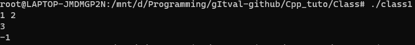
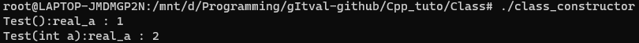
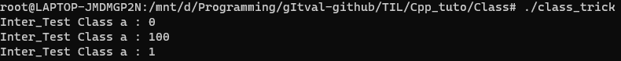

# C++ Class

대충 구조체 내부에 함수를 정의 할 수 있도록 기능을 추가하여 만든 느낌이다.

## 정의

```c++
#include <iostream>

using namespace std;

class Test { // Test Class 정의
public:      // class 내 멤버 변수 및 함수 선언
        int a;
        int b;
        int c;
        int Test_calc1(); // 멤버 함수 선언
        int Test_calc2(){ // 멤버 함수 선언 및 정의
            return a-b;
        }
        void set_c(int c);
};  // ";"세미콜론으로 끝남. (구조체와 같음)

int Test::Test_calc1(){ // class 내 객체 함수 정의
        return a+b;
}

void Test::set_c(int c){
    this->c = c;        // this 사용
}

int main(){
        Test test_class;    // Test class 정의
        test_class.a = 1;   // "."으로 멤버 변수에 접근
        test_class.b = 2;

        // 새로 입력받음
        cin >> test_class.a;
        cin >> test_class.b;

        cout << test_class.Test_calc1() << endl;      // "."으로 멤버 함수에 접근
        cout << test_class.Test_calc2() << endl;      // "."으로 멤버 함수에 접근

        return 0;
}
```



### this?

- python class의 self같은 것임.

- python class에서는 class 맴버 함수를 정의 할때 첫번째 인자로 객체(자기 자신 class)를 뜻하는 self인자를 넣어줬는데,<br/>C++에서도 마찬가지로 this는 객체(자기 자신 class)의 주소를 뜻하는 것임.

- this는 class의 주소를 나타내므로 구조체와 마찬가지로 내부 멤버의 값에 접근 할때 "->"를 이용해서 접근함.

- C++에서는 python과 다르게 멤버 함수의 인자마다 this를 넣어주진 않지만,<br/>그건 그냥 편의상 그런 것일뿐 실제로 컴파일을 하게 되면 첫번째 인자로 this가 들어가게 됨.

```c++
// 컴파일 전
class Test{
	int a;  
public:
  	int return_a(){
    	return this->a;   
    }
};

// 컴파일 후
class Test{
	int a;  
public:
  	int return_a(Test * this){ // this 매개변수
    	return this->a;   
    }
};
```

- this는 **멤버 함수의 매개 변수와 멤버 변수의 이름이 같은 경우**나 **객체(클래스)의 주소를 리턴**해야 할 경우 사용함. (단, static 함수의 경우 사용 불가능)

## 생성자

```c++
// class_constructor.cpp
#include <iostream>

using namespace std;

class Test{
public:
    int real_a;
    Test();			// 매개변수 없는 생성자 선언(기본 생성자)
    Test(int a);	// 매개변수 있는 생성자 선언
};

Test::Test(){		// 매개변수 없는 생성자 정의
    real_a = 1;
    cout << "Test():real_a : " << real_a << endl;
}

Test::Test(int a){	// 매개변수 있는 생성자 정의
    real_a = a;
    cout << "Test(int a):real_a : " << real_a << endl;
}

int main(){
    Test test1;
    Test test2(2);

    return 0;
}
```



생성자(constructor)는 이름대로 class가 생성될 때 호출되는 함수이다. (python class의 \__init__)

- 생성자를 딱히 선언해주지 않는 경우 컴파일러가 기본 생성자를 알아서 만들어줌.
- 하지만, 생성자가 하나라도 선언된 경우에는 컴파일러가 만들어 주지 않으니 주의 할 것.
- 생성자는 리턴 타입이 존재하지 않는다. (있으면 에러뜸...)

## 소멸자

```c++
// class_destructor.cpp
#include <iostream>

using namespace std;

class Test{
public:
    ~Test(); // 소멸자 선언
};

Test::~Test(){ // 소멸자 정의
    cout << "Called Destructor!" << endl;
}

int main(){
    Test test;

    return 0;
}
```

소멸자(destructor)는 생성자의 반대로 class가 사라질 경우 호출되는 함수이다.

- 소멸자의 특징은 class명 앞에 '~'가 붙는다는 것이다.
- 소멸자는 한 class당 한개만 존재한다. (복수로 존재 불가능)
- 소멸자는 어떠한 값도 리턴 할 수 없다.
- 생성자와 마찬가지로 소멸자 또한 선언되어 있지 않는 경우 컴파일러가 자동으로 생성한다.
- 소멸 타이밍 
  - 지역 변수로 class를 선언 했을 경우, 해당 함수가 종료되는 시점이다. (스택 프레임이 정리되는 타이밍)
  - 전역 변수로 class를 선언 했을 경우, 프로그램이 종료되는 시점이다.

## 접근 지정자

class 내부 함수 또는 변수에 접근 할 수 있는 권한을 정하는 것임.

```C++
class Test{
private:
	// private 멤버 선언
public:
	// public 멤버 선언
protected:
	// protected 멤버 선언
};
```

### 접근지정자 : private

```C++
// private 예시
class Test{
    int private_default; 		// 이런식으로 접근 지정자를 선택해주지 않은 경우에는 기본적으로 private로 설정된다.
private:
    int private_a;				// private 접근지정자 사용
public:
    int private_func(int A);
};

int Test::private_func(int A){
    private_a = A;				// 이런식으로 같은 클래스의 멤버 함수 private_func는 private 변수에 접근이 가능하다.
    private_default = A;		// 얘도 마찬가지
}

int main(){
    Test test;
	test.private_func(1);		// (성공) private 변수인 private_a와 private_default에 1을 저장. 
    test.private_a = 100; 		// (에러) 직접 접근 : private 변수인 private_a에 외부에서 접근 불가능.
    
    return 0;
}
```

위의 예시와 같이 동일한 클래스의 맴버 함수만 접근 가능하다.

- 지정하지 않은 변수의 경우에는 자동으로 private로 설정된다.
- 주로 멤버 변수는 private 또는 protected로 설정하여 외부에서 직접적으로 접근이 불가능하게 하고 private_func와 같이 함수를 제공하여 값을 수정할 수 있게 한다고함.

### 접근지정자  : public

```c++
// public 예시
class Test{
public:							// public 설정
    int public_a;
    int public_func(int A);
};

int Test::public_func(int A){
    public_a = A;				// 당연하지만 내부 함수에서 내부 변수에 접근 가능.
}

int main(){
    Test test;
	test.public_func(1);		// (성공) public 변수인 public_a에 1을 저장함. 
    test.public_a = 100;		// (성공) 직접 접근 : public 변수인 public_a에 클래스 외부에서 접근하여 100을 저장함.
    
    return 0;
}
```

위의 예시와 같이 꼭 동일한 클래스가 아니더라도 아무나 접근이 가능하다.


### 접근지정자  : protected

```c++
// protected 예시
class Test{
protected:   					// protected 설정
   	int protected_a;
public:							// public 설정
    int protected_func(int A);
};

int Test::protected_func(int A){
    protected_a = A;			// 클래스 멤버 함수인 protected_func를 통해서 protected 변수에 접근
}

int main(){
    Test test;
	test.protected_func(1);		// (성공) protected 변수인 protected_a 1을 저장함. 
    test.protected_a = 100;		// (에러) 직접 접근 : protected 변수인 protected_a 외부에서 직접 접근 불가능.
    
    return 0;
}
```

위의 예시와 같이 얼핏보면 private와 같아보이지만 protected는 **동일한 클래스+상속된 자식 클래스**의 맴버까지로 접근범위가 더 넓다.


## 상속
상속은 이름대로 **부모 클래스의 것을 자식 클래스가 물려받는 것**임.
```c++
// 부모 클래스 1
class Test_father{
public:
	int father_a;
}

// 부모 클래스 2
class Test_mother{
	// ...
}

// Test_father와 Test_mother를 상속받는 Test_child1
class Test_child1 : public Test_father, Test_mother{ // 다중 상속
public:
	int child_b;
}

// Test_mother만 상속받는 Test_child2
class Test_child2 : public Test_mother{				 // 단일 상속
	// ...
}
```

- 그냥 쉽게 위와 같이 서로 다른 클래스에 겹치는 내용이 있다면, 매번 복붙하여 추가할 필요 없이 그냥 그대로 상속받아 사용하는 것임.
- 자식 클래스는 상속받은 부모 클래스의 멤버에 접근이 가능함. (단, 부모 클래스의 public과 protected에만 가능.)
- 다중 상속의 경우 부모 클래스의 멤버의 이름이 겹치거나 할 경우 문제가 발생할 수 있음.
- 빠른 코딩 가능
- 부모 클래스를 기본 클래스라고도 하고, 자식 클래스를 파생 클래스라고도 함.

### 업 캐스팅 (파생 -> 기본)
```C++
int main(){
    Test_child1 Tchild1;
    Test_child1 * pTchild1 = &Tchild1;
    Test_father * pUpcasting = pTchild1;	// 업 캐스팅
    
    pTchild1->child_b = 1;					// (성공) 
    pUpcasting->father_a = 100; 			// (성공) 
    pUpcasting->child_b = 200; 				// (에러) : 업 캐스팅된 포인터가 자식 클래스의 변수를 가리키지 못함.
    
    return 0;
}
```

업 캐스팅은 파생(자식) 클래스가 기본(부모) 클래스가 되는 것을 말한다.

- 업 캐스팅을 하고나면 기존에 파생 클래스가 가지고 있던 맴버 변수 또는 함수에는 접근이 불가능해진다.

### 다운 캐스팅 (기본 -> 파생)

```C++
int main(){
    Test_child1 Tchild1;
    Test_child1 * pTchild1;
    Test_father * pDowncasting = &Tchild1;	// 업 캐스팅
    
    pTchild1 = (Test_child1 *)pDowncasting;	// 다운 캐스팅 // 강제 형변환 필요.
    pTchild1->child_b = 100;				// (성공) : 접근 가능
    
    return 0;
}
```

다운 캐스팅은 기본(부모) 클래스가 파생(자식) 클래스가 되는 것을 말한다.

- 다운 캐스팅을 하고나면 파생 클래스가 가지고 있는 멤버 변수 또는 함수에 접근이 가능해진다.
- 다운 캐스팅을 할때는 **강제 형변환**이 필요하다. ex) (Test_child1 *)pDowncasting;


## 트릭?

### 같은 클래스를 각각 따로 선언한 경우, private 변수에 접근 할 수 있을까?

성운이형이 이런 질문을 주셨다. 

나는 당연히 안될거라고 생각했는데 **내부에서 자기 자신을 선언하는 경우에는 가능**했다..! (재귀... 선언?)

예시 코드는 아래와 같다.

```C++
// class_trick.cpp
#include <iostream>

using namespace std;

class Test{
private:
    int a;
    void Test_private(){
        a = 1;
    }
public:
    void Test(){		// 생성자
        this->a = 0;
    }
    void Test_public(){ // 내부에서 자기 자신을 선언
        Test inter_test;
        cout << "Inter_Test Class a : " << inter_test.a << endl;
        inter_test.a = 100; 		// private 변수 a에 직접 접근
        cout << "Inter_Test Class a : " << inter_test.a << endl;
        inter_test.Test_private(); 	// private 함수 Test_f에 직접 접근
        cout << "Inter_Test Class a : " << inter_test.a << endl;
    }
};

int main(){
    Test test;
    test.Test_public();
    
    return 0;
}
```



- **[주의!]** 참고로 이런식으로 사용하는 경우, 위의 예시와 같이 함수를 이용해서 선언하는 등의 방식을 따로 지정해주지 않게되면, 생성자가 무한이 호출되어 컴파일까지는 되더라도 실행했을 경우, 스택이 터져버릴 수도 있으니 유의하자.


~~_(문제로 만들면 좋을지도...?)_~~

## Reference

- 2학년 1학기때 들은 객체지향 프로그래밍1 수업 ppt 자료
- 빛성운 형님 : https://blog.fetchinist.com/?p=483 - 트릭?

