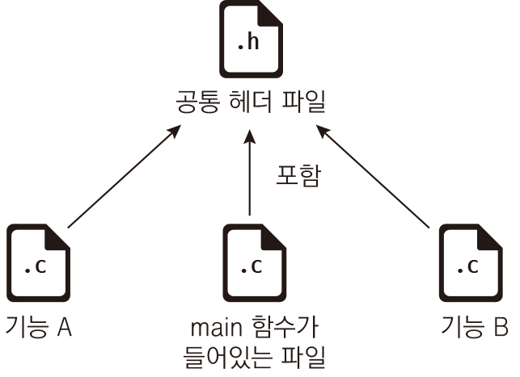
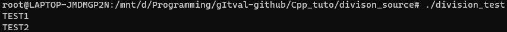

# 소스 파일 분할 (Division Source Code)

## 사용하는 이유

하나의 소스코드 파일(.c 또는 .cpp)을 사용하는 것보다 깔끔하게 코드를 작성할 수 있다.

## 이걸 작성하는 이유

실제 버그바운티를 위해서 오픈소스 코드들을 보면 소스 파일을 분할해서 코드를 짜놨기 때문에 어떻게 하는건지 궁금해서 찾아봄.

## 그래서 어떻게 하는데


위 그림과 같이 하나의 공통 헤더 파일을 사용해서 컴파일한다.

**[*] 예시 코드**

```C++
//common.h
#include <iostream>

void Test1();
void Test2();
```

```C++
//division_src1.cpp
#include "common.h"

void Test1(){
    std::cout << "TEST1" << std::endl;
}
```

```C++
//division_src2.cpp
#include "common.h"

void Test2(){
    std::cout << "TEST2" << std::endl;
}
```

```C++
//main.cpp
#include "common.h"

int main(){
    Test1();
    Test2();
    
    return 0;
}
```
- 먼저 위와 같이 common.h 공통 헤더파일을 하나 생성하여 Test1과 Test2 함수를 미리 선언해준다.
- 다음으로 division_src1.cpp과 division_src2.cpp처럼 분할할 파일들에 common.h를 include해주고, 각각 함수들을 정의 해준다.
- 마지막으로 main.cpp에 common.h를 include 해주고, 분할된 파일들에 정의되어 있는 함수를 호출해주면 된다.
- 아래는 결과



## 컴파일은?

컴파일 방법은 다음과 같다.

- ```bash
  g++ [분할 파일1 path] [분할 파일2 path] [분할 파일3 path] ... -o [최종 결과 파일 이름 및 path]
  (C언어일 경우 gcc로하면 됨.)
  ```

위와 같이 그냥 분할된 파일들을 헤더파일만 빼고 한꺼번에 입력해주면 된다.

```
실제로 컴파일한 명령어 : g++ ./division_main.cpp ./division_src1.cpp ./division_src2.cpp -o ./division_test
```

## 헤더파일 충돌 대비
이런식으로 개발을 하게 되면 헤더 파일이 중복이 될 수 있다.

그런 경우에는 #ifdef, ifndef 등과 같은 조건 전처리기 문을 사용하면 충돌을 막을 수 있다.

```C++
// file1.cpp
#define TEST_H
#include "Test.h"
...
```

```C++
// file2.cpp
#ifndef TEST_H

#define TEST_H
#include "Test.h"

#endif
```


## Reference

https://dojang.io/mod/page/view.php?id=675 - 이미지 파일 출처
