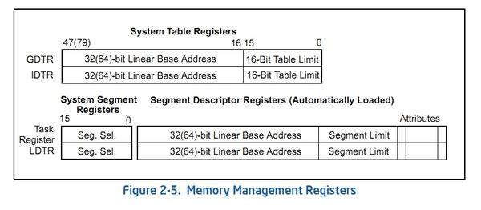
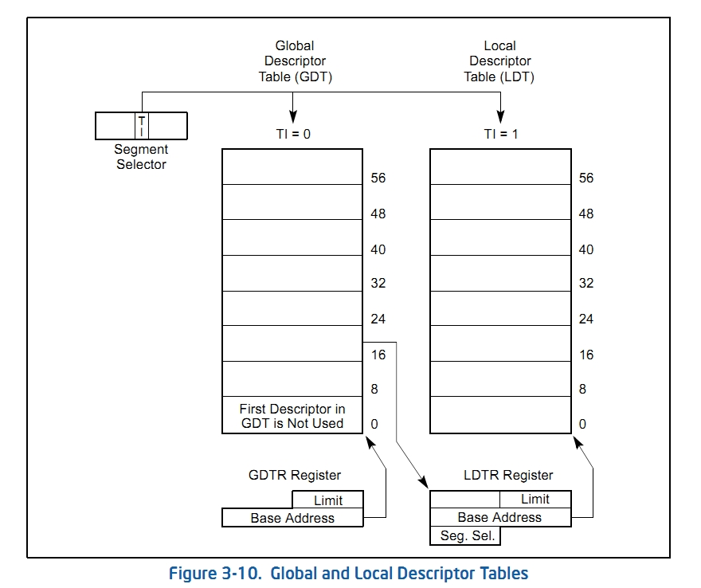

#  GDT, LDT, GDTR, LDTR

## SDT란?

Segment Descriptor Table의 약자로 세그먼트 디스크립터들을 모아둔 구조체이다. 

크게 GDT와 LDT로 나누어진다.

자세한건  Segment Register 포스팅을 참고하자.

## GDT(Global Discriptor Table)

- GDT는 커널 모드에서 사용되는 SDT이다. 
- LDT들을 관리하기 위해 CPU가 사용하는 SDT이다.
- LDT들의 시작 주소와 그 크기 등이 작성되어 있는 테이블이다.
- 시스템 상에 딱 하나 있다.
- 세그먼트가 아니다.

## LDT(Global Discriptor Table)

- LDT는 유저 모드에서 사용되는 SDT이다.
- 특정 프로세스의 세그먼트 디스크립터들을 모아둔 구조체이다.
- LDT는 프로세스마다 각각 1개씩 생성된다.
- 세그먼트이다.

## GDTR과 LDTR의 구조

여기서 정리할 GDTR, LDTR의 구조는 아래 그림과 같다.

## GDTR (GDT Register)

- GDTR은 GDT의 시작주소와 그 크기를 담고있는 레지스터이다. 
- 32bit는 선형 주소상의 GDT 시작주소(Base Addreess)를 나타내고, 16bit는 GDT의 한계주소(Table Limit(대충 크기))를 나타낸다.
- 프로세스가 사용하는 명령어는 아래와 같다. 
  - LGDT : Load GDT의 약자로 GDT를 GDTR에 로드할 때 사용한다. (Load : 메모리 -> 레지스터) 
  - SGDT : Store GDT의 약자로 GDT를 GDTR에 저장할 때 사용한다. (Store : 레지스터 -> 메모리)
- 프로세서가 리셋 또는 켜졌을 경우 GDTR의 Base Address는 0으로, Table Limit는 0xffff로 초기화 된다.
-   보호 모드로 전환시 GDT의 Base Address와 Table Limit를 GDTR로 로드해야 한다.

## LDTR (LDT Register)

- LDTR은 LDT의 Base Address와 LDT의 Table Limit를 가지고 있고, 추가로 Segment Selector와 Segment Attribute 또한 가지고 있는 
  레지스터이다.
- LDT는 반드시 GDT 내에 존재해야한다.
- LDTR의 Segment Selector는 GDT에 있는 특정 LDT에 대한 디스크립터를 셀렉트 하기 위한 용도이다. 
  (LDTR에서 GDT에 있는 LDT정보를 가져오기 위한 용도.)
- 프로세스가 사용하는 명령어는 아래와 같다.

  - LLDT : Load LDT의 약자로 LDT를 LDTR에 로드할 때 사용한다. (Load : 메모리 -> 레지스터)  LLDT가  세그먼트 셀렉터를 LDTR로 로드할 때 Base Address, Table Limit, Descriptor Attributes가 LDT 세그먼트 디스크립터로부터 자동적으로 
    로드된다.
  - SLDT : Store LDT의 약자로 LDT를 LDTR에 저장할 때 사용한다. (Store : 레지스터 -> 메모리)
- Task Switching이 발생하면 LDTR에는 새로운 세그먼트 셀렉터와 디스크립터의 내용으로 자동적으로 채워진다. 하지만, 이전의 LDTR의 내용은 저장되지 
  않는다.
- 프로세서가 리셋 또는 켜졌을 경우 LDTR의 Base Address는 0으로, Table Limit는 0xffff로 초기화 된다.
- LDTR 또한 세그먼트 레지스터의 Hidden Part처럼 LDT에 대한 Segment Discriptor를 저장하기 위한 캐시를 가지고 있다.

## 사용

- Segment Selector의 TI Flag가 0이라면 GDT, 1이라면 LDT를 가리키고 있는 것이다.

- GDTR에는 GDT의 시작 주소를 가리키는 Base Address와 GDT의 크기를 나타내는 Limit가 있다.
- GDT의 0번째 디스크립터는 사용하지 않는 디스크립터로 "Null Descriptor"라고 불린다.
- LDTR에서 LDTR의 Segment Selector를 이용해서 GDT에 있는 특정 LDT값을 가져온다.
- LDTR에 로드된 특정 LDT의 Base Address, Limit값으로 LDT에 참조한다.

## Reference

- http://egloos.zum.com/anster/v/2138204 - 모든글...
