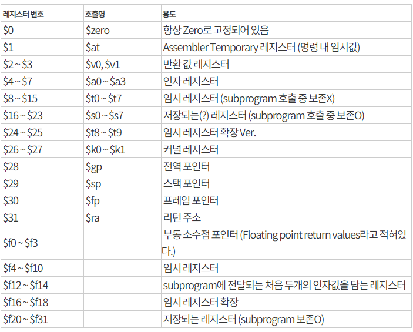
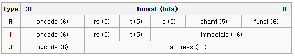

# MIPS 

MIPS는 공유기 같은 임베디드 장비에 사용되는 소프트웨어 언어?이다. (어셈블리의 종류? 그런느낌)

해킹을 하기 위해서는 디버깅을 할 수 있어야 하므로 당연히 알고 있어야 한다.


## 레지스터

MIPS는 특이하게 레지스터가 $에 숫자 표시로 명시되어 있음.

코딩할때는 호출명을 이용해서 사용함.



여기서 중요한건 

- $ra : 리턴 주소, 얘를 스택에 저장하기 때문에 bof 가능
- $sp : 스택 포인터 (= esp)
- $fp : 프레임 포인터 (= ebp)
- $v0, $v1 : 리턴 값
- eip레지스터는 그냥 pc레지스터가 따로 있어서 그걸 사용하나봄. (자세히 모르겠슴.)

## 명령어

명령어는 R type, I type, J type와 같이 총 3가지 종류가 있음.



- R(egister) type은 모든 오퍼렌드가 레지스터인 **명령어**를 뜻한다.

  - rd (dest) : 목적지 오퍼랜드를 뜻함. (두개의 레지스터에 대한 연산 이후 값을 저장할 레지스터임.)

  - rs (src) : 출발지 오퍼랜드를 뜻함. (연산에 사용되는 첫번째 레지스터임.)

  - rt (target) : 타겟 오퍼랜드를 뜻함. (연산에 사용되는 두번째 레지스터임.)

  - shamt : shift 명령어에서 Shift 양을 나타내는 부분이다. 다른 명령어에서는 항상 0이다.

  - funct : opcode와 함께 명령어의 종류를 나타낸다.

  - 이게 뭔소리냐면 아래와 같은 예시로 설명을 하겠다.

    ```assembly
    add $16, $8, $9 
    ```

    rd = $16 : 저장할 목적지 레지스터

    rs = $8 : 연산에 사용되는 첫번째 레지스터

    rt = $9 : 연산에 사용되는 두번째 레지스터

    위 코드는 결과적으로 $16레지스터에 $8레지스터 값과 $9 레지스터의 값을 더한 값을 저장한다는 뜻이다.

    위와 같이 **모든 오퍼랜드가 레지스터인 명령어 add가 R type 명령어가 되는 것이다.**

  - 이 코드의 매핑은 아래와 같이 된다.

    
    | opcode (= add) | rs   | rt   | rd   | shamt | funct |
    | :------------- | :--- | :--- | :--- | :---- | :---- |
    | 32             | 8    | 9    | 16   | 0     | 32    |
  
- I(mmediate) type은 오퍼렌드에 상수값이 포함된 **명령어**를 뜻한다.

  - rs와 rt는 R type과 같다. 근데 여기서 rt는 rd와 같은 역할을 한다.

  - immediate : 16비트로 표현할 수 있는 상수값이다. 즉시값이라고 부른다.

  - 보통 **일반 상수 값**이나 **특정 주소의 오프셋 값**이다.

  - 아래 코드를 예시로 들어보겠다.

    ```assembly
    # 특정 주소의 오프셋 값으로 사용한 경우
    # int 형의 배열
    # C코드 : Array[2] =  Temp + Array[4];
    
    lw $8, 16($18)    # $18은 Array[0]이라고 가정함 # lw : 값을 Load함. $8에 메모리 16($18)의 값을 저장.
    add $8, $16, $8   # $16은 Temp라고 가정함.
    sw $8, 8($18)     # sw : 값을 Store함. $8의 값을 메모리 8($18)에 저장.
    ```

    위에서 사용된 16($18)은 특정 주소의 오프셋 값으로 사용된 것이다.

    $18에 저장되어있는 메모리의 주소에서 +16을 한 곳에 위치한 값을 저장한다는 뜻이다.

    ```assembly
    # 일반 상수 값으로 사용한 경우
    # addi : add immediate
    addi $1,$2,100 
    ```

    위 코드의 뜻은 $1에 $2의 값과 100을 더한 값을 저장한다는 뜻이다. ($1 = $2+100)

  - **특정 주소의 오프셋 값으로 사용한 경우 코드**에 대한 매핑은 아래와 같이 된다.

    
    | opcode (= lw) | rs   | rt   | immediate |
    | ------------- | ---- | ---- | --------- |
    | 35            | 18   | 8    | 16        |
    
  - **일반 상수 값으로 사용한 경우 코드**에 대한 매핑은 아래와 같이 된다.
    | opcode (= addi) | rs   | rt   | immediate |
    | --------------- | ---- | ---- | --------- |
    | 8               | 2    | 1    | 100       |
    
  - [!중요] 참고로 addi와 $0을 이용해서 mov 명령어와 같은 역할을 하도록 할 수 있다.
  
    ```assembly
    addi $18, $0, 1000
    ```
  
    위와 같은 코드의 경우 $0에는 무조건 0이 저장되어 있으므로, $18에 1000을 저장하라는 뜻이 된다.
  
    $18 = 1000. 즉, ```mov $18, 1000```과 같음.
  
- J(ump) type은 주로 분기문에 사용하는 **명령어**이다.

  - opcode와 address로 구성된다.

  - address 값에는 상수 값이 있을 수 있다.

  - 아래 코드를 예시로 보겠다.

    ```assembly
    # j 코드
    j 1000
    ```
    
    매우 간단하게 생겼다.
    
    - 첫번째 코드는 address 1000으로 jump를 하겠다는 뜻이다.
    
  - j 코드에 대한 매핑은 아래와 같다.
    | opcode (= j) | address |
    | ------------ | ------- |
    | 2            | 1000    |

더 자세한 명령어들은 **MIPS_Instruction_Set.pdf** 를 참고하면 된다.


## 디버깅 환경 구축 방법

https://training-1.tistory.com/189 <== 디버깅 환경 구축하는 법에 대해 써있음


## 더욱 자세한 설명

https://go-madhat.github.io/mips_Hello_World/	<== mips 아키텍쳐에서 리버싱하는게 적혀있습니다. + 컴파일 환경 구성하는것도 있어요.


## Reference 

**MIPS_Instruction_Set.pdf** <== 파일에 밉스 명령어에 대한 정리가 잘되어 있어서 올립니다.

https://midascopp.tistory.com/93 <== 한글로 된 opcode의 bit 수나 MIPS 레지스터 같은거 잘 정리되어 있는 곳 + 사진 출처

https://wally0813.github.io/arm%20exploit/mips%20exploit/2019/04/29/arm_mips/ <== ARM & MIPS Exploit를 하기 위한 참고 자료들이 정리되어있음 

https://iamswdeveloper.tistory.com/entry/MIPS-%EB%AA%85%EB%A0%B9%EC%96%B4 <== 명령어 타입에 대해 정리가 잘되어있음 + 사진 출처

http://alumni.cs.ucr.edu/~vladimir/cs161/mips.html <== MIPS Opcode 값들

