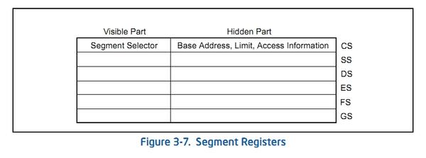
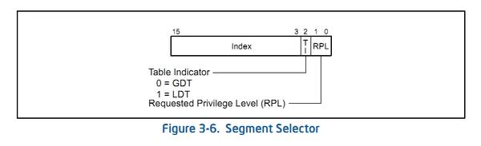
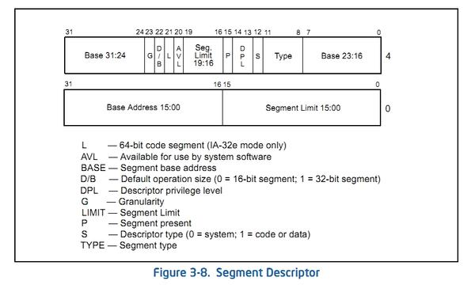
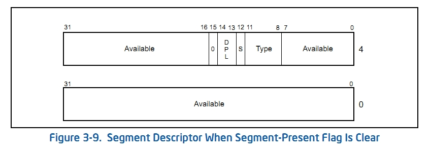

# Segment Register 정리 (약간만...)

## Segment?

보조기억장치(예를 들어 디스크)에 있는 데이터의 가변 길이 블록. 
전체 세그먼트는 주기억장치(RAM)의 사용 가능한 공간에 임시로 복사될 수 있거나 (=세그먼테이션) 
주기억장치로 일일이 복사될 수 있는 페이지들로 분할 될 수 있다.(=세그먼테이션과 페이징)  
(참고. 운영체제:내부구조 및 설계원리 p.336) 여기에서 말하는 세그먼트는 주기억장치와 보조기억장치 사이에서 스왑할 때를 말한다.

Segment는 한 프로세스의 메모리를 가변적인 크기 + 용도별로 나눈  단위. 
각각 메모리 별로 크기, 권한(읽기, 쓰기, 실행) 등을 용도 별로 알맞게 나눈 단위이다. 

크게 아래와 같이 나누어진다. 

**Code Segment : 실제로 프로그램이 실행하는 명령어들이 있는 영역. 
Data Segment : 데이터들을 모아둔 영역. (전역 변수, 사용되는 문장 등) 
Heap Segment : 동적 할당 메모리 영역 
Stack Segment : 스택 영역** 

## Segment Register란?

**CS, SS, DS, ES, FS, GS** 들로 각각 대응되는 **SDT(Segment Descriptor Table) 의 Index와 논리적 Segment의 시작주소, 범위, 접근 권한 등을 가지고 있는 레지스터들**이다.  
(SDT는 Segment Descriptor를 연속적으로 여러개를 가지고 있는 구조체 배열) 
이중 ES, FS, GS는 추가적인 데이터 세그먼트 레지스터라고 한다. 

각각 아래와 같이 대응된다. 
**CS : Code Segment 
SS : Stack Segment 
DS : Data Segment 
ES : Extra(Data) Segment 
FS : Data Segment 
GS : Data Segment** 

### Segment Register의 구조

위의 이미지와 같이 **보이는 부분(Visible Part)**와 **숨겨진 부분(Hidden Part)**으로 나누어져 있다. **[*] 참고** : 근데 https://stackoverflow.com/questions/21143689/size-of-intel-x86-segment-registers-and-gdtldt-register?answertab=active#tab-top를 보면
그냥 세그먼트 레지스터는 Segment Selector가 끝이고, Hidden Part는 그냥 연관된 일을 하고 근접해있는 캐시 메모리로 다른거라고 한다...
정확한지는 모르니 일단 둘다 알고있으면 좋을듯...

#### [+] 보이는 부분(Visible Part)

보이는 부분은 유저 관점에서 유일하게 접근 가능한 영역이다. (숨겨진 부분은 접근 불가능함.) 

보이는 부분에는 **Segment Selector**가 있다. 
**Segment Selector란? SDT에서 Segment Descriptor를 식별하기 위한 Index 값을 가지고 있는 것이다.** 
(여기서의 Index는 Offset 주소와 같은말이다.) 
(16비트 리얼 모드에서는 ( Segment Register * 16 + 오프셋 주소 )로 실제 주소를 구하고, 보호 모드에서는 세그먼트 레지스터에 씌여진 값이 바로 주소로 연결되는 것이 아닌 Descriptor Table에서의 오프셋을 의미한다.) 
(몇몇 주요 커널 관련 서적에서는 Segment Selector와 Segment Register를 같은 것으로 설명하는데,  
그 이유가 보호 모드에서는 Segment Register가 항상 Segment Selector 값을 저장하기 위한 용도로 사용되기 때문이라고 합니다.) 

Segment Selector의 구조는 위와 같다. 
**Index : 13bit : SDT에서의 Offset이 저장된다. 
TI (Table Indicator) : 1bit : 0이면 GDT, 1이면 LDT에 SDT가 위치하고 있다고 알려주는 플래그 비트이다. 
RPL (Requested Privilege Level) : 2bit :  셀렉터가 가리키는 세그먼트의 권한을 나타낸다. 0~3의 값으로 표현하고 낮을수록 높은 권한이다.  0이면 커널 레벨, 3이면 유저레벨을 뜻한다고 한다.** 

#### [잠깐!] GDT와 LDT란?

**GDT**는 Global Descriptor Table의 약자로 **커널 모드**에서 사용되는 테이블이다. 
**LDT**는 Local Descriptor Table의 약자로 **유저 모드**에서 사용되는 테이블이다. 

**GDT**는 **시스템 상에 딱 하나**만 있고, **LDT**는 **각 프로세스별로 하나씩** 만들어진다. 
따라서 메모리에는 한개 이상의 LDT가 존재하게 되는데, GDT는 이러한 LDT들을 관리하기 위해서 CPU가 사용하는 테이블이다. GDT는 LDT의 **시작 주소와 그 크기 등이 작성되어 있는 테이블**이다. 

**그렇다면 어떻게 GDT와 LDT를 찾을까?** 
CPU 내에는 **GDTR(GDT Register)**과 **LDTR(LDT Register)**이 있다. 

**GDTR**은 GDT의 시작 주소와 그 크기를 담고 있는 레지스터로 이것을 이용하여 GDT를 찾는다.  

**LDTR**은 각 프로세스에 대해 준비된 LDT의 위치를 담고 있는 레지스터이다. 커널 모드(OS)에서 유저 모드(어플리케이션)로 제어권이 넘어갈 때, OS는 LDTR에 해당 프로세스의 LDT를 가리키는 GDT의 Offset을 설정하고 LDTR을 이용하여 각 프로세스에 대한 LDT를 찾는다. 

(만약 프로세스에서 해당 레지스터를 건들게 된다면 메모리보호가 터질 수도 있으므로, **프로세스는 GDTR과 LDTR에 참조 또는 수정 할 수 없다**고 한다.) 

#### [+] 숨겨진 부분(Hidden Part)

숨겨진 부분은 **프로세서가 Segment Discriptor를 미리 캐쉬하기 위한 영역**으로 사용된다.  Size는 어째 알아보는 곳마다 어디는 48bit, 64bit, 80bit 등등 다채롭게 나오는데 캐시하는 용도니까 그냥 64bit라고 생각하는게 좋겠따... (이게 없으면 사용 할때마다 LDT주소를 GDT에서 참조해야하는데 그렇게 되면 할때마다 유저 모드 -> 커널 모드 -> 작업 -> 유저 모드의 번거로움이 있기 때문이라고 생각함... (LDTR에 참조할 수 없기 때문에...)) 

Segment Descriptor의 구조는 위와 같다. 

**base Address Field** : 상위 4byte의 31bit-24bit까지 8bit + 상위 4byte의 7bit-0bit까지 8bit + 하위 4byte의 31bit-16bit까지 16bit  = 총 32bit : 세그먼트의 시작 주소

**Segment Limit Field** : 상위 4byte의 19bit-16bit까지 4bit + 하위 4byte의 15bit-0bit 까지 16bit = 총 20bit : 세그먼트의 한계 주소(세그먼트의 크기). 크기의 단위는 G Flag를 참고.

**Type Field** : 11bit-8bit까지 4bit : **세그먼트의 종류(code, data 등...) + 읽고 쓰기가 가능한지 등**을 나타낸다. 
Type Field의 최상위 bit가 0이면 데이터 세그먼트, 1이면 코드 세그먼트이다.

**s(System) Flag** : 1bit : **시스템 세그먼트인지 코드 또는 데이터 세그먼트인지에 대한 것을 나타내는 Flag**.  
(LDT와 GDT를 구분하는 플래그인듯함)  
0이면 시스템 세그먼트, 1이면 코드 또는 데이터 세그먼트이다.

**DPL(Descriptor Privilege Level) Field** : 2bit : 0~3의 값으로 **메모리의 특권 레벨**을 나타냄. Segment Selector에 있는 것과 같음.

**L (64 bit Code Segment) Flag** : 1bit : **IA-32e 모드에서 Code Segment가 64 bit모드에서 실행되는지 확인하는 Flag**. 1인 경우 64bit 모드에서 실행 되는 중이라는 뜻이고 0인 경우 32bit 호환 모드에서 실행 되는 중을 뜻한다. 만약 데이터 세그먼트라면 이 값은 항상 0으로 고정이다.  

**D/B (Default Operation Size / Default Stack Pointer Size and / or Upper Bound ) Flag** : 1bit : 

- **실행 가능한 코드 세그먼트인 경우** : **해당 플래그는 D Flag가 된다. 세그먼트의 지시로 참조되는 유효 주소 및 피연산자에 대한 기본 길이를 나타낸다.**  **1인 경우** **32bit 주소**와 **32bit 또는 8bit 피연산자**로 가정됨.  **0인 경우** **16bit 주소**와 **16bit 또는 8bit 피연산자**로 가정됨.
- **스택 세그먼트인 경우** : **B (Big) 플래그가 되며, Implicit Stack 동작(Puch, Pop, Call 등)에 사용되는 Stack Pointer의 크기를 지정한다**.  1이면 32bit ESP 레지스터에 저장되는 32bit 스택 포인터를 사용하고,  0이면 16bit SP 레지스터에 저장되는 16bit 스택 포인터를 사용한다. 
   만약, 스택 세그먼트가 Expend-down 데이터 세그먼트로 설정된 경우에는 스택 세그먼트의 상한을 지정한다. (바로 다음 문단)
- **Expend-down 데이터 세그먼트인 경우** : **B 플래그가 되며 세그먼트의 상한(위쪽의 한계)을 지정한다.**  1이면 상한은 0xFFFFFFFF(4 GB)이고, 0이면 상한은 0xFFFF(64 KB)이다. 

**G (Granularity) Flag** : 1bit : **Limit Field에 영향을 주는 Flag이다.**  1이면 Limit Field의 단위는 4KB가 되고, 0이면 Limit Field의 단위는 Byte가 된다.

**P (Segment Present) Flag** : 1bit : **접근이 가능한지 아닌지를 나타내는 Flag 이다.**  1인 경우 물리 메모리에 올라와 접근 가능함을 의미. 0인 경우 접근 불가능.
												아래는 P Flag가 0인 경우 Segment Descriptor의 모습이다.

## Reference

http://egloos.zum.com/anster/v/2135644 - 내용들과 이미지를 여기서 많이 참고하였습니다... 
https://myfreechild.tistory.com/entry/Memory-Segmentation-II - 어지럼증 약을 먹은 것처럼 궁금한걸 해소시켜주는 내용들이 있었습니다... 
https://5kyc1ad.tistory.com/265 - Segment Selector의 Offset, GDT, LDT 등... https://m.blog.naver.com/PostView.naver?isHttpsRedirect=true&blogId=whitemate&logNo=53189987 - GDT와 LDT에 대해서 참고 http://jackpark88.blogspot.com/2018/03/segment-register.html
+빛선구 형님
+빛성운 형님
+빛동현 형님
http://egloos.zum.com/anster/v/2138204 - GDT,LDT, GDTR, LDTR...

######  + fs 레지스터는 어째서 gdb에서 볼수 없는것인가...를 알아보려고 하다가 여기까지 왔는데 결국 궁금한건 해결하지도 못하고 그냥 어지럽네요... 보고 틀린부분 있으면 알려주시면 감사하겠습니다...
