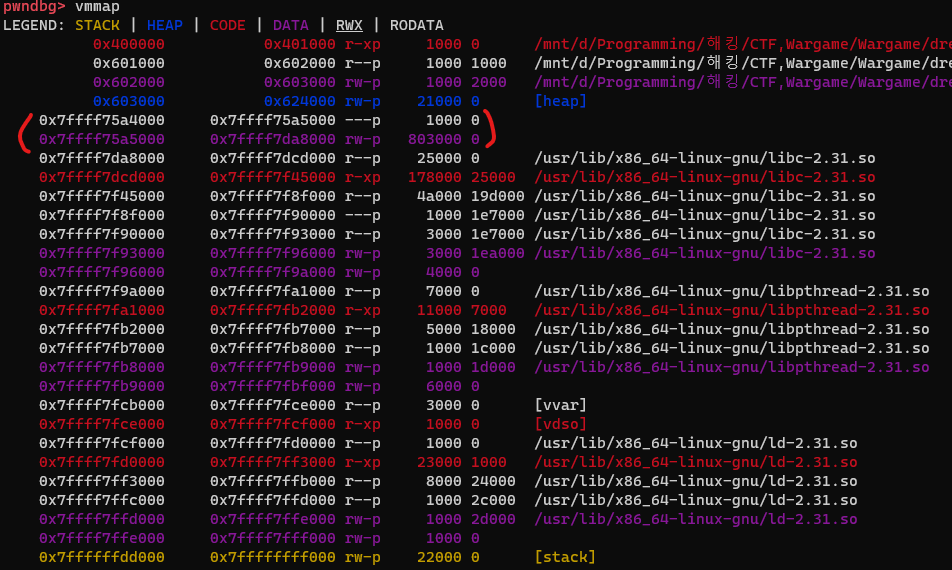
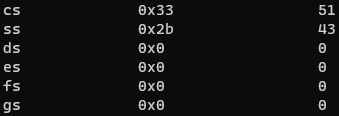

# TLS/TCB정리
## TLS란?
**Thread Local Storage**의 약자로 non main thread를 사용하는 경우 전역 변수에 대해 레이스 컨디션이 일어나는 것을 방지 하기 위해 non main thread만의 전역 변수 저장 공간을 할당해주는 것.

### TLS 선언
```c
__thread int x; // __thread 키워드 사용
```
선언을 하게 되면 ELF파일에 .tbss/.tdata 영역이 추가로 생성되며 해당 영역에 __thread로 선언한 변수들이 초기화됨.
.tbss/.tdata 영역은 이후 링크 과정에서 PT_TLS 타입의 데이터 세그먼트로 합쳐지게됨. <br/>(이렇게 만들어진 데이터 세그먼트를 __초기화 이미지(initialization image)__라고 한다.)<br/>
실행 도중 새로운 thread가 생성되면, 초기화 이미지를 해당 thread의 TLS영역에 복사되며 초기화됨. (즉, 모든 스레드에 대해 TLS 변수들의 초기값은 **동일**함.)

## TCB란?
**Thread Control Block**의 약자로 현재 실행중인 스레드를 관리하는데 사용하는 구조체이다.
```c
typedef struct
{
  void *tcb;                /* Pointer to the TCB.  Not necessarily the
                           thread descriptor used by libpthread.  */
  dtv_t *dtv;	// [A]
  void *self;                /* Pointer to the thread descriptor.  */
  int multiple_threads;
  int gscope_flag;
  uintptr_t sysinfo;
  uintptr_t stack_guard;	// [B]
  uintptr_t pointer_guard;
  unsigned long int vgetcpu_cache[2];
  /* Bit 0: X86_FEATURE_1_IBT.
     Bit 1: X86_FEATURE_1_SHSTK.
   */
  unsigned int feature_1;
  int __glibc_unused1;
  /* Reservation of some values for the TM ABI.  */
  void *__private_tm[4];
  /* GCC split stack support.  */
  void *__private_ss;
  /* The lowest address of shadow stack,  */
  unsigned long long int ssp_base;
  /* Must be kept even if it is no longer used by glibc since programs,
     like AddressSanitizer, depend on the size of tcbhead_t.  */
  __128bits __glibc_unused2[8][4] __attribute__ ((aligned (32)));
  void *__padding[8];
  
} tcbhead_t;
```
### [A] : DTV
DTV란 **Dynamic Thread Vector**의 약자로 로드된 각 모듈(실행 파일 및 공유 라이브러리)의 TLS 영역의 시작 주소를 가지고 있는 포인터이다.
TCB 내에는 로드된 각 모듈(실행 파일 및 공유 라이브러리)의 TLS 영역의 시작 주소를 가지고 있는 DTV (Dynamic Thread Vector)의 포인터를 가지고 있다.

### [B] : stack_guard
```
mov    rax, QWORD PTR fs:[0x28]
```
x64환경에서 master canary 값을 가져오는 경우 항상 위와 같이 **fs 레지스터**에서 0x28 offset에 있는 값을 가져온다.
이유는 **fs레지스터는 해당 스레드의 tcbhead_t의 주소를 저장하고 있기 때문이다.** (참고: x86의 경우에는 gs 레지스터를 사용)<br/>
fs레지스터의 0x28 offset에는 tcbhead_t의 **uintptr_t stack_guard;** 변수를 가리킨다.<br/>
**즉, stack_guard변수에는 master canary가 저장되어있다.**
<br/>(참고로 윈도우에서의 fs 레지스터는 TEB(Thread Environment Block)을 가리키고 있다고 합니다. TEB는 리눅스의 TCB와 비슷한 역할을 하는 구조체랍니다...)

### pthread_create 함수로 스레드가 사용할 메모리공간을 할당할 경우
1. 먼저 mmap을 이용해서 할당을 한다. 이후 스레드가 사용하게될 스택영역과 TLS영역으로 나눈다.
2. 할당된 곳에서 최상위 주소 부분은 TLS영역, 나머지는 스레드의 스택이된다. (스택 성장때문에 overflow가 되는 것을 방지하기 위해서인듯...)<br/>
3. TLS영역에서도 최상위 부분이 TCB영역이 된다. 
```
---------------------------------
        ------------------------- 낮은 주소
               스레드가 사용할 스택
 mmap   -------------------------
   할당                 TLS 변수
   영역    TLS 영역  --------------
                           TCB
        ------------------------- 높은 주소
---------------------------------
```
mmap을 이용해서 스레드가 사용할 스택과 TLS영역을 같이 할당받기 때문에 vmmap명령어로 확인하는 경우에는 구분해서 볼 수 없다.


### tcbhead_t의 주소를 알아내기 위해서는?
#### 1. 인라인 어셈블리를 통해 알아내야한다.
```asm
mov    rax, QWORD PTR fs:[0x10] // void *self; 변수
```
tcbhead_t의 self변수는 tcbhead_t의 주소를 저장하고 있기 때문에 위와 같이 하여 알아내야한다고 함. (취약점이 없다는 가정하에)


왜냐면 위와 같이 gdb에서 info reg 명령어로는 fs 레지스터의 값이 0x0으로 보이기 때문이다.
<br/>~~(여기부터는 아직 이해 못했어요... 맞는지 확인해주시면 감사하겠습니다...!)~~<br/>
https://stackoverflow.com/questions/28209582/why-are-the-data-segment-registers-always-null-in-gdb 에 따르면
```
mov    fs, eax
```
위와 같이 명령어를 이용해서 값을 저장/수정 하게되면 더 느리기 때문에 이런 방법을 사용하지 않고 <br/>
CPU 내부 세그먼트 디스크립터에서 fs에 값을 저장하는 커널 매커니즘을 사용하여 더 빠르게 하기 때문에 그렇다고 합니다.

#### 2. 카나리 값으로 찾아낸다.
tcbhead_t의 stack_guard 변수에는 **master canary값**이 들어있다고 했다.
그리고 이 tcbhead_t는 언재나 스택의 **최상위 주소**에 위치한다.

즉, pwndbg의 search 명령어나 gdb-peda의 find 명령어를 이용해서 canary 값을 메모리 내에서 검색한 후 <br/>(**검색된 canary 값들 중 가장 최상위 주소의 canary값**이 위치한 주소 - 0x28)을 하면 tcbhead_t의 주소를 얻을 수 있다.


## Reference
- https://tribal1012.tistory.com/157
- https://kangwoosun.github.io/pwnable,%20analysis/2020/02/08/Pwnable-linux-canary/
- http://egloos.zum.com/studyfoss/v/5259841
+ 빛선구 형님